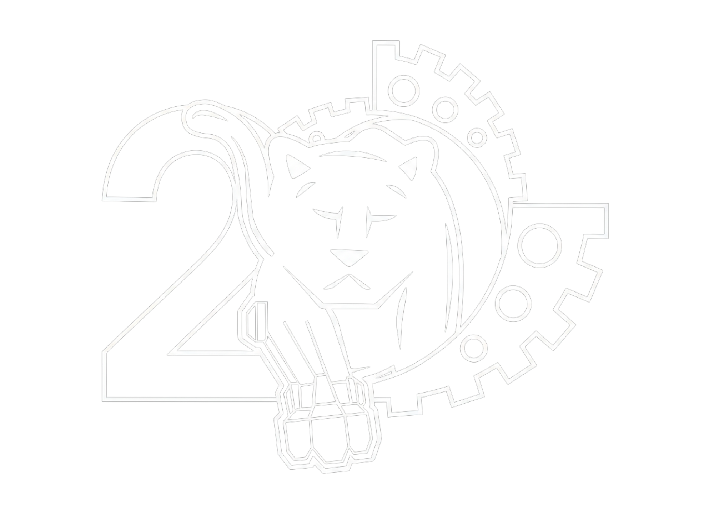

<div align="center">

<!-- 🖼️ TEAM LOGO — replace src with your logo file, e.g. media/2283-logo.png -->


# 🌀 HURAKÁN
### FRC Team 2283 — Panteras | 2026 Season "REBUILT" | Laguna Regional

[](https://github.com/Panteras2283/2283_2026_Rebuilt_Laguna)
[](https://docs.wpilib.org/)
[](https://pathplanner.dev/)
[]()
[](https://github.com/Panteras2283/2283_2026_Rebuilt_Laguna/wiki)

**[📖 Full Documentation Wiki](https://github.com/Panteras2283/2283_2026_Rebuilt_Laguna/wiki)** • **[🎮 Controller Mapping](#-controller-mapping)** • **[🚀 Getting Started](#-getting-started)**

</div>

---

## 📸 Meet Hurakán

<!-- 🖼️ ROBOT PHOTOS — drop images into a /media folder and update these paths -->
<p align="center">
  
  
  
</p>

<!-- 🎥 MATCH / REVEAL VIDEO — replace VIDEO_ID with your YouTube video ID -->
<div align="center">

[](https://www.youtube.com/watch?v=ZNziPRv8LTk)

*Click above to watch our robot in action*

</div>

> Add as many clips as you want — qualification matches, pit build timelapses, driver practice. Just repeat the thumbnail-link pattern above with each video's ID.

---

## 🤖 About This Repo

This repository contains the complete robot code for **Hurakán**, Team 2283's competition robot for the 2026 **Rebuilt** season. It's built on WPILib + Java, with swerve drive generated via CTRE's Phoenix Tuner X, autonomous routines built in PathPlanner, and vision powered by Limelight + PhotonVision.

The kids on this team have put together a genuinely deep engineering wiki — subsystem breakdowns, command structures, constants, vision/odometry pipelines, all of it. **This README is the highlight reel; the [wiki](https://github.com/Panteras2283/2283_2026_Rebuilt_Laguna/wiki) is the full manual.**

### 🛠️ Built With

| Purpose | Tool |
|---|---|
| Robot code | WPILib (VS Code) |
| Swerve generation & CTRE config | Phoenix Tuner X |
| REV motor/sensor config | REV Hardware Client |
| Autos & teleop trajectories | PathPlanner |
| Driver Station / dashboard / SysID | FRC Game Tools + Elastic |
| Vision (primary) | Limelight |
| Vision (secondary) | PhotonVision (Arducam) |
| Firmware flashing | Balena Etcher |
| LED control | WLED |

### 📂 Repo Structure

```
2283_2026_Rebuilt_Laguna/
├── SwerveWithPathPlanner/   # Swerve drivetrain + PathPlanner integration
├── deploy/pathplanner/      # Autonomous paths & auto routines
├── vendordeps/              # Third-party library dependencies
└── elastic-layout.json      # Driver Station dashboard layout
```

For a deep dive into subsystems, commands, and constants, see the wiki pages: [Subsystems](https://github.com/Panteras2283/2283_2026_Rebuilt_Laguna/wiki/Subsystems) · [Commands](https://github.com/Panteras2283/2283_2026_Rebuilt_Laguna/wiki/Commands) · [Constants](https://github.com/Panteras2283/2283_2026_Rebuilt_Laguna/wiki/Constants) · [RobotContainer](https://github.com/Panteras2283/2283_2026_Rebuilt_Laguna/wiki/RobotContainer) · [Vision & Odometry](https://github.com/Panteras2283/2283_2026_Rebuilt_Laguna/wiki/Vision-and-Odometry)

---

## 🎮 Controller Mapping

Just like a video game — two "players," two very different jobs. **Player 1** drives the robot around the field. **Player 2** runs the superstructure (intake, feeder, shooter).

### 🕹️ Player 1 — Driver Controller

| Input | Action |
|---|---|
| **Left Stick (X/Y)** | Translate — drive the robot around the field |
| **Right Stick (X)** | Rotate the robot |
| **Start** | Reset field-centric gyro heading |
| **A** | 🛡️ X-Stance brake — lock the wheels defensively |
| **Left Bumper** | ⚡ Fast `DriveToPose` — quick auto-align |
| **Right Bumper** | 🎯 Precise `DriveToPose` — fine docking with targets |
| **D-Pad ↑ (POV 0)** | Fast `DriveToPose` to a designated slot |

### 🕹️ Player 2 — Operator Controller

| Input | Action |
|---|---|
| **Left Bumper** | Toggle superstructure → `IDLE` |
| **Right Bumper** | Toggle superstructure → `SHOOTING` |
| **Y** | Manual `ShootOverride` sequence |
| **X** | Reverse the spindexer to clear jams |
| **A** | `ShakeFeeder` sequence |
| **D-Pad ↓ (POV 180)** | Lower intake + spin feeder (intake note) |
| **D-Pad ↑ (POV 0)** | Reverse feeder to outtake |
| **D-Pad ← (POV 270)** | Raise intake without spinning feeder |

> 📖 The authoritative, always-up-to-date version of this table lives on the [Controls and Bindings wiki page](https://github.com/Panteras2283/2283_2026_Rebuilt_Laguna/wiki/Controls-and-Bindings) — update it there first, then mirror changes here.

---

## 🚀 Getting Started

1. **Clone the repo**
   ```bash
   git clone https://github.com/Panteras2283/2283_2026_Rebuilt_Laguna.git
   ```
2. **Open in WPILib VS Code** — File → Open Folder → select the cloned directory.
3. **Build** with `Ctrl+Shift+P` → `WPILib: Build Robot Code`.
4. **Deploy** to the RoboRIO with `Ctrl+Shift+P` → `WPILib: Deploy Robot Code`.
5. **Load the dashboard layout** — open `elastic-layout.json` in Elastic for the pre-built driver display.
6. **Vision setup** — configure the Limelight via Limelight Hardware Manager and the Arducam via PhotonVision (see [Vision and Odometry](https://github.com/Panteras2283/2283_2026_Rebuilt_Laguna/wiki/Vision-and-Odometry)).

---

<div align="center">

### 🐾 Team 2283 — Panteras

*Pantera No Cualquiera.*

<!-- Swap in your team's real links -->
[Instagram](https://www.instagram.com/panterasup/) 

</div>
